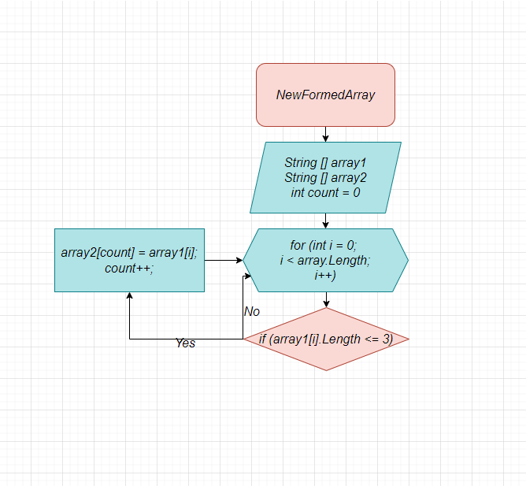

# FinalTask

# Задача:
Написать программу, которая из имеющегося массива строк формирует массив из строк, длина которых меньше либо равна 3 символа. 
Первоначальный массив можно ввести с клавиатуры, либо задать на старте выполнения алгоритма.
При решении не рекомендуется пользоваться коллекциями, лучше обойтись исключительно массивами.

# Решение задачи:

1. Создаем 2 массива типа string. Первый массив задан изначально ({"Hello", "Russia", "2", "1234", "123", "Computer", "12"}), второй задаем такой же длины.
2. Создаем метод, в котором есть цикл (for), соразмерный длине массива.
3. Внутри цикла (for) добавляем проверку условия (<=3). Если длина элемента первого массива меньше или равна трем, то заносим в "count" элемент второго массива. Так, перебираем весь заданный массив и находим все элементы меньше или равные 3.
4. Создаем метод, который выводит новый массив в консоль.

# Блок схема:

